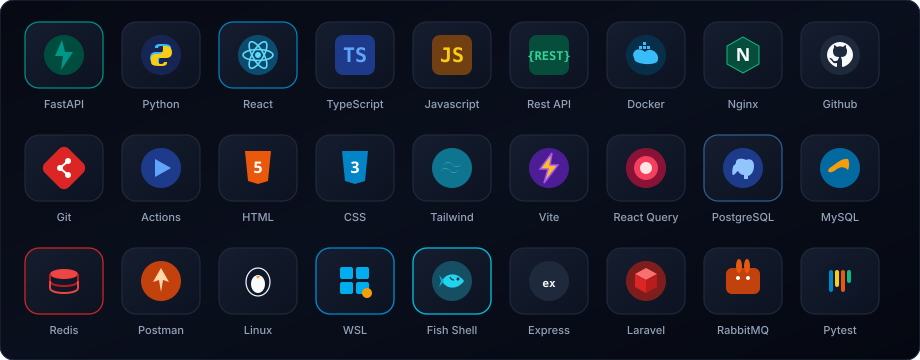

  <!-- Animated Cyber-Architecture Hero Banner -->
  

   

  <!-- Animated Typing Subheader -->
  

    
  

  <!-- Status & Affiliation Badges -->
  

    
    
    
    
    
  

  <!-- Connect & Socials -->
  

    
    
    
    
  

---

## 👨‍💻 About Me & Engineering Focus

<table width="100%">
  <tr>
    <td width="50%" valign="top">
      <h3>🏛️ Institutional Engineering</h3>
      
Core backend contributor at <b><a href="https://github.com/UIGM-IT-Dev">UIGM IT Dev</a></b>, architecting campus-wide production services, API integrations, and robust institutional systems.

    </td>
    <td width="50%" valign="top">
      <h3>🚀 Core Stack Specialization</h3>
      
Building high-velocity fullstack platforms using <b>FastAPI (Python 3.12)</b> on the backend and <b>React 18 + TypeScript</b> on the client with strict end-to-end type safety.

    </td>
  </tr>
  <tr>
    <td width="50%" valign="top">
      <h3>⚙️ Backend Architecture</h3>
      
Asynchronous event loops, <b>Pydantic V2</b> schema validation, <b>SQLAlchemy ORM</b>, PostgreSQL optimization, Redis pub/sub queues, and ultra-low-latency <b>WebRTC</b> media streaming.

    </td>
    <td width="50%" valign="top">
      <h3>🎨 Modern Frontend Craft</h3>
      
Declarative component architecture powered by <b>React</b>, <b>Vite</b>, <b>TanStack Query</b> for server-state synchronization, <b>Tailwind CSS</b>, and polished <b>Shadcn UI</b> design tokens.

    </td>
  </tr>
</table>

---

## My favorite tools and technologies ⚙️

> Tools and technologies that I have worked with and am interested in

  

---

## 📊 GitHub & Contribution Stats

<!-- stats:start -->
<table width="100%">
  <tr>
    <td width="50%" align="center">
      
    </td>
    <td width="50%" align="center">
      
    </td>
  </tr>
  <tr>
    <td colspan="2" align="center">
      
    </td>
  </tr>
</table>

  ⚡ Automated metrics synced at 2026-09-06 06:56 UTC

<!-- stats:end -->

---

## 📈 Star History

  <a href="https://star-history.com/#farhanop/farhanop&Date">
    <picture>
      <source media="(prefers-color-scheme: dark)" srcset="https://api.star-history.com/svg?repos=farhanop/farhanop&type=Date&theme=dark" />
      <source media="(prefers-color-scheme: light)" srcset="https://api.star-history.com/svg?repos=farhanop/farhanop&type=Date" />
      
    </picture>
  </a>

---

## 🔄 Recent Activity & Commit Feed

<!-- recent-activity:start -->
- ⭐ Starred [`fastapi/full-stack-fastapi-template`](https://github.com/fastapi/full-stack-fastapi-template) (2026-08-09 04:30 UTC)

⚡ Last activity sync: 2026-09-06 06:56 UTC
<!-- recent-activity:end -->

---

## 💡 Engineering Philosophy

  <blockquote>
    <h3><i>“Building scalable systems is not merely about writing lines of code — it is about architecting systems that remain understandable, maintainable, and resilient under evolving loads.”</i></h3>
    — Software Craftsmanship &amp; Architectural Rigor
  </blockquote>

   

  <!-- Animated Dynamic Wave Footer -->
  

